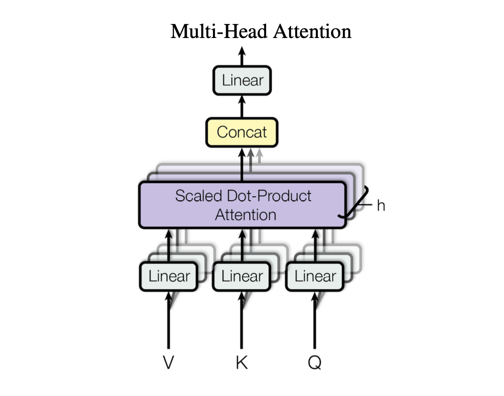

This is a dummy content for the blog.

## Dummy Content H2

This is a dummy content for the blog.

Now I have changed paragraphs. Let me talk a little about RNNs versus Transformers. RNNs are pretty much so a sequence of of data put into machine learning models, and it passes it forward through layers, allowing it to collect information from the previous layers.

Meanwhile, Transformers are a bit clever with their attention mechanism. They can look at all the data at once, which makes them really good at understanding context. This is because they can weigh the importance of each piece of data, and use that to make predictions. This is a big deal because it means that Transformers can understand the meaning of words in a sentence, even if the words are in a different order. This is what sets them apart from RNNs, because although RNNs such as LSTMs and GRUs are great at understanding sequential data, they can't look at all the data at once.

### Dummy Content H3

This is a dummy content for the blog.

Here's a link to a nice [YouTube video](https://www.youtube.com/watch?v=dQw4w9WgXcQ) about Transformers versus RNNs.

Here's an image rendered from a markdown file:



Here's some code:

```python
import torch
import torch.nn as nn

class Attention(nn.Module):
    def __init__(self, d_model: int, n_heads: int):
        super().__init__()
        self.d_model = d_model
        self.n_heads = n_heads
        self.q = nn.Linear(d_model, d_model)
        self.k = nn.Linear(d_model, d_model)
        self.v = nn.Linear(d_model, d_model)
        self.o = nn.Linear(d_model, d_model)

    def forward(self, x: torch.Tensor) -> torch.Tensor:
        q = self.q(x)
        k = self.k(x)
        v = self.v(x)
        qk = torch.matmul(q, k.transpose(-2, -1))
        qk = qk / (self.d_model ** 0.5)
        qk = torch.softmax(qk, dim=-1)
        return self.o(torch.matmul(qk, v))
```

Here's some code with long rows:

```tsx
import React from 'react';
import { useState } from 'react';
import { useEffect } from 'react';
import { useRef } from 'react';
import { useCallback } from 'react';
import { useMemo } from 'react';
import { useReducer } from 'react';
import { useContext } from 'react';

export default function Carousel({ items }: { items: string[] }) {
  const [currentIndex, setCurrentIndex] = useState(0);
  const carouselRef = useRef<HTMLDivElement>(null);
  const isDragging = useRef(false);
  const startX = useRef(0);
  const scrollLeft = useRef(0);

  useEffect(() => {
    if (carouselRef.current) {
      carouselRef.current.addEventListener('mousedown', (e) => {
        isDragging.current = true;
        // so, the current position of the mouse is the pageX, and the offsetLeft is the position of the carousel. So, we can get the position of the mouse relative to the carousel.
        startX.current = e.pageX - carouselRef.current.offsetLeft;
        scrollLeft.current = carouselRef.current.scrollLeft;
      });
    }
  }, []);
  return <div className="carousel" ref={carouselRef}>
    {items.map((item, index) => (
      <div key={index} className="carousel-item">
        {item}
      </div>
    ))}
  </div>
}

```

Quoted text:

> This is a quoted text. Transformers are a type of neural network architecture that are used for natural language processing tasks.

Quoted text with a link:

> This is a quoted text with a link. [Transformers](https://en.wikipedia.org/wiki/Transformer_(machine_learning)) are a type of neural network architecture that are used for natural language processing tasks.